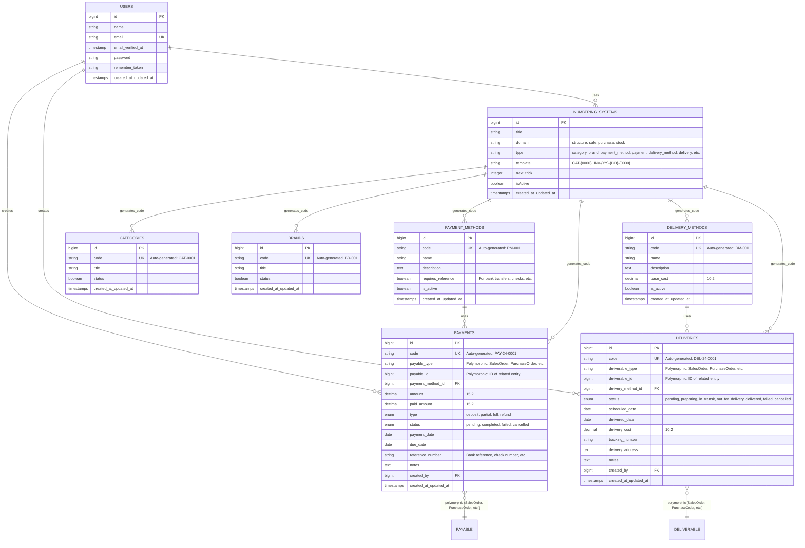

# Database Schema

## Visual Database Schema Diagram

## Table Descriptions

### Core Tables

#### `users`
- **Purpose**: User authentication and authorization
- **Key Fields**: `id`, `email`, `password`
- **Relationships**: 
  - One-to-many with `payments` (created_by)
  - One-to-many with `deliveries` (created_by)

#### `numbering_systems`
- **Purpose**: Manages auto-generated codes for all entities
- **Key Fields**: `domain`, `type`, `template`, `next_trick`
- **Domains**: `structure`, `sale`, `purchase`, `stock`
- **Types**: `category`, `brand`, `product`, `payment_method`, `payment`, `delivery_method`, `delivery`, `invoice`, `order`, `quotation`, `transfer`, `adjustment`, `deposit`
- **Relationships**: Used by all entities for code generation

### Structure Tables

#### `categories`
- **Purpose**: Product categories
- **Key Fields**: `code` (auto-generated), `title`, `status`
- **Code Format**: `CAT-{0000}` (e.g., CAT-0001)
- **Relationships**: Uses `numbering_systems` for code generation

#### `brands`
- **Purpose**: Product brands
- **Key Fields**: `code` (auto-generated), `title`, `status`
- **Code Format**: `BR-{000}` (e.g., BR-001)
- **Relationships**: Uses `numbering_systems` for code generation

### Payment Tables

#### `payment_methods`
- **Purpose**: Available payment methods (Cash, Bank Transfer, Credit Card, etc.)
- **Key Fields**: `code` (auto-generated), `name`, `requires_reference`, `is_active`
- **Code Format**: `PM-{000}` (e.g., PM-001)
- **Relationships**: 
  - One-to-many with `payments`
  - Uses `numbering_systems` for code generation

#### `payments`
- **Purpose**: Tracks all payments (deposits, partial, full, refunds)
- **Key Fields**: 
  - `code` (auto-generated)
  - `payable_type` + `payable_id` (polymorphic)
  - `amount`, `paid_amount`, `type`, `status`
- **Code Format**: `PAY-{YY}-{0000}` (e.g., PAY-24-0001)
- **Payment Types**: `deposit`, `partial`, `full`, `refund`
- **Status**: `pending`, `completed`, `failed`, `cancelled`
- **Relationships**: 
  - Many-to-one with `payment_methods`
  - Many-to-one with `users` (created_by)
  - Polymorphic with any payable entity (SalesOrder, PurchaseOrder, etc.)

### Delivery Tables

#### `delivery_methods`
- **Purpose**: Available delivery/shipping methods
- **Key Fields**: `code` (auto-generated), `name`, `base_cost`, `is_active`
- **Code Format**: `DM-{000}` (e.g., DM-001)
- **Relationships**: 
  - One-to-many with `deliveries`
  - Uses `numbering_systems` for code generation

#### `deliveries`
- **Purpose**: Tracks delivery status and information
- **Key Fields**: 
  - `code` (auto-generated)
  - `deliverable_type` + `deliverable_id` (polymorphic)
  - `status`, `scheduled_date`, `delivered_date`, `tracking_number`
- **Code Format**: `DEL-{YY}-{0000}` (e.g., DEL-24-0001)
- **Status Flow**: `pending` → `preparing` → `in_transit` → `out_for_delivery` → `delivered`
- **Relationships**: 
  - Many-to-one with `delivery_methods`
  - Many-to-one with `users` (created_by)
  - Polymorphic with any deliverable entity (SalesOrder, PurchaseOrder, etc.)

## Relationships Summary

### Direct Foreign Key Relationships
1. **payments** → **payment_methods** (payment_method_id)
2. **payments** → **users** (created_by)
3. **deliveries** → **delivery_methods** (delivery_method_id)
4. **deliveries** → **users** (created_by)

### Polymorphic Relationships
1. **payments** → **payable** (payable_type + payable_id)
   - Can link to: SalesOrder, PurchaseOrder, or any future entity
2. **deliveries** → **deliverable** (deliverable_type + deliverable_id)
   - Can link to: SalesOrder, PurchaseOrder, or any future entity

### Code Generation Relationships
All entities with `code` field use **numbering_systems** for auto-generation:
- categories → numbering_systems (domain: structure, type: category)
- brands → numbering_systems (domain: structure, type: brand)
- payment_methods → numbering_systems (domain: structure, type: payment_method)
- payments → numbering_systems (domain: sale, type: payment)
- delivery_methods → numbering_systems (domain: structure, type: delivery_method)
- deliveries → numbering_systems (domain: stock, type: delivery)

## Indexes

### Primary Indexes
- All tables have `id` as primary key
- All code fields are unique indexes

### Foreign Key Indexes
- `payments.payment_method_id`
- `payments.created_by`
- `deliveries.delivery_method_id`
- `deliveries.created_by`

### Composite Indexes
- `payments(payable_type, payable_id)` - For polymorphic queries
- `deliveries(deliverable_type, deliverable_id)` - For polymorphic queries

### Status/Date Indexes
- `payments.status`
- `payments.payment_date`
- `deliveries.status`
- `deliveries.scheduled_date`
- `categories.status`
- `brands.status`
- `payment_methods.is_active`
- `delivery_methods.is_active`

## Future Tables (Not Yet Implemented)

The schema is designed to support:
- **sales_orders** - Will use payments and deliveries polymorphically
- **purchase_orders** - Will use payments and deliveries polymorphically
- **products** - Will reference categories and brands
- **customers** - Will be referenced by sales_orders
- **suppliers** - Will be referenced by purchase_orders
- **stock_transfers** - Will use deliveries polymorphically
- **invoices** - Will use payments polymorphically

## Design Patterns

### 1. Polymorphic Relationships
- **payments** and **deliveries** use polymorphic relationships to work with any entity
- This allows flexibility without creating separate tables for each entity type

### 2. Auto-Generated Codes
- All entities use **numbering_systems** for consistent code generation
- Codes follow templates with date placeholders and zero-padding
- Examples: `CAT-0001`, `PAY-24-0001`, `DEL-24-0001`

### 3. Status Management
- Payment status: `pending` → `completed` / `failed` / `cancelled`
- Delivery status: `pending` → `preparing` → `in_transit` → `out_for_delivery` → `delivered`
- Entity status: `active` / `inactive` (for categories, brands, methods)

### 4. Soft Deletes Ready
- Tables can easily add `deleted_at` column for soft deletes
- Currently using hard deletes with validation

## Data Flow Examples

### Creating a Payment
1. User creates payment for a SalesOrder
2. System generates code using numbering_systems (domain: sale, type: payment)
3. Payment is linked polymorphically to SalesOrder
4. Payment status can be tracked independently

### Creating a Delivery
1. User creates delivery for a SalesOrder
2. System generates code using numbering_systems (domain: stock, type: delivery)
3. Delivery is linked polymorphically to SalesOrder
4. Delivery status progresses through workflow

### Code Generation Flow
1. Entity creation triggers model boot event
2. Model calls `generateCode()` static method
3. Method queries `numbering_systems` by domain and type
4. Uses `getNextNumber()` which increments `next_trick`
5. Returns formatted code based on template

